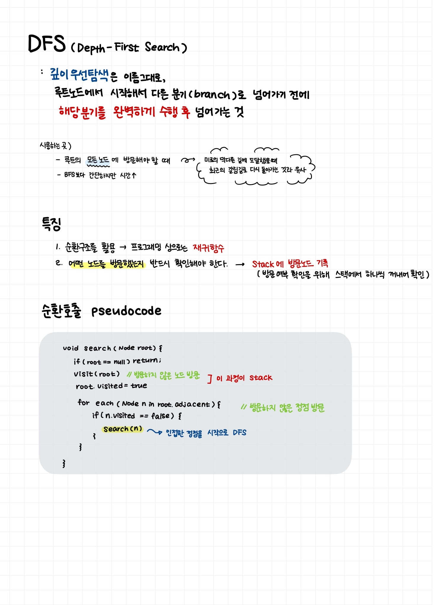

# 보현 5주차 - BFS DFS

`BFS(Breadth-First Search)`

루트 노드에서(혹은 랜덤노드) 선택한 지점으로부터 가장 인접한 노드들부터 방문하는 방법
인접한 게 없으면 저장해놨던 다음 노드에서 다시 조사한다.
-> 이 경우 **Queue**를 사용하여 해결

`DFS(Depth-First Search)`

루트 노드에서(혹은 랜덤노드) 선택한 지점에서 갈 수 있는 노드들로 전부 이동
-> 갈 수 있는 게 없다면 그 이전으로 다시 돌아와서 확인



## 1. 타겟 넘버

> 문제)
>
> n개의 음이 아닌 정수들이 있습니다. 이 정수들을 순서를 바꾸지 않고 적절히 더하거나 빼서 타겟 넘버를 만들려고 합니다. 예를 들어 [1, 1, 1, 1, 1]로 숫자 3을 만들려면 다음 다섯 방법을 쓸 수 있습니다.
> 사용할 수 있는 숫자가 담긴 배열 numbers, 타겟 넘버 target이 매개변수로 주어질 때 숫자를 적절히 더하고 빼서 타겟 넘버를 만드는 방법의 수를 return 하도록 solution 함수를 작성해주세요.

일단 생각을 정리해보면,

1. 모든 노드를 +로 설정한다
2. 다녀간 노드를 -로 설정한다
3. 해당 단계까지 진행했을 때, 노드들의 합이
   1. 타겟넘버보다 크면 -> 현재 노드를 음수로 바꾸고(뺄셈) 다음 노드로 이동
   2. 타겟넘버보다 작으면 -> 불가능.
   3. 타켓넘버와 같으면 count 추가, 남아있는

```JavaScript
let count = 0;

function solution(numbers, target) {

    numbers.sort((a,b) => b-a); //오름차순 정렬

    const sum = numbers.reduce((acc, curr) => {return acc + curr},0);
    let testSum = sum;

    check(numbers,target,count,sum);

    return count;
}

function check(numbers,target,count,sum) {
    var testSum = sum;

    for (let i=0;i<numbers.length;i++) {
        testSum = testSum - numbers[i]*2;

        if (testSum>target) continue;
        else if (testSum===target) {
            count++;
            check(numbers.slice(i,numbers.length),0,count,testSum);
            testSum = sum;
        }
        else if (testSum<target){
            testSum=sum;
        }
    }

}
```

그런데 이렇게 하니 문제는, maximum 문제가 발생...
아마 재귀함수에서 reduce 함수를 구하는 게 문제였던 걸로 생각함.
재귀를 제거하니 테스트케이스에서는 오류가 없는데, 전체 채점을 하면 틀린 케이스가 나옴.

잘한풀이)

```JavaScript

function solution(numbers, target) {
    let answer = 0;
    getAnswer(0,0);
    function getAnswer(x,value) {
        if(x<numbers.length){
            getAnswer(x+1,value + numbers[x]);
            getAnswer(x+1,value - numbers[x]);
        } else{
            if(value === target){
                answer++
            }
        }
    }
    return answer;
}

```

해결방법)
Stack을 사용하여 후입선출 방식, 재귀함수를 활용하여 순환구조를 만드는 게 DFS의 핵심 포인트다.
재귀함수가 아직 제대로 확확 정리되지는 않는 것 같다.

DFS와 BFS의 이론적 내용만 알았지, 실제 코드 구현은 잊어버린 상태인 것 같아 다시 코드 복습하는 과정을 가졌다! **순환구조에 대한 이해도 필요해 보인다.**

---

## 2.네트워크

네트워크의 수 = 방문하지 않은 노드 + 1

로 계산하면 된다. 즉, BFS를 활용하여 모든 노드에 대해 조사하고 방문하지 않은 노드의 수를 구하면 되는 것!

BFS를 해당 문제에 대해 사용하려면 다음과 같이 진행하면 된다

기본설정 - 방문 유무를 확인하는 과정이 필요하므로, computer의 개수 크기만큼 visit 를 생성하고 false로 채운다.

아래는 queue를 활용한 BFS이다.

1. 처음으로 방문한 노드를 queue에 추가하고, 방문한 것으로 체크한다.
2. 인접하지만 방문하지 않은 노드가 있으면 queue에 넣고 방문한 것으로 체크한다.
3. queue에 노드가 더이상 없을 때까지 반복한다.
4. 모든 초기 정점에 대해 반복한다.

```JavaScript
function solution(n, computers) {

    let visit = []; //방문 여부 체크
    let count = 0;

    for (let i=0;i<computers.length;i++) visit.push(false);

    function check(node) {
        let nodes = [node]; //방문해야 하는 노드
        while (nodes.length !== 0)
        {
            var i = nodes[0];
            visit[i] = true; //노드 방문

            for (let j=0;j<computers.length;j++)
            {
                if (i===j) continue;
                else if (!visit[j] && computers[i][j])
                {
                    nodes.push(j);
                }
            }
            nodes.shift();
        }
    }


    for (i=0;i<computers.length;i++)
    {
        if (!visit[i])
        {
            check(i);
            count++;
        }
    }
    return count;

}
```

### 추가사항) 코드 간단하게 만드는 법

1. visit array에 false 값으로 가득 채우는 걸 for-loop을 사용했지만, `new Array(n).fill()`을 쓰면 가능하다

   - let visit = new Array(n).fill(false);

## 3. 게임 내 맵 최단거리

### 유념해야 할 것

current position이 pos[i][j]라고 할 때, 갈 수 있는 지점은 동,서,남,북이므로
`pos[i][j+1]`,`pos[i][j-1]`,`pos[i+1][j]`, `pos[i-1][j]` 중에서 1인 값이다.

미로처럼 막다른 길에 도달했을 때는 DFS를 사용하는 편이다. 끝까지 갔다가 막다른 길이 나오면 그 직전으로 돌아가는 **Stack**을 사용해야 한다

남,동>서,북 순으로 진행하는 게 좋음

```JavaScript
function solution(maps) {
    var answer = 0;
    const n = maps[0].length-1;
    const m = maps.length-1;
    var count = 0;

    function move(xpos,ypos) {
        if (xpos === n && ypos === n) return count;

        if (xpos<m-1 && maps[xpos+1][ypos])
        {
            count++;
            move(xpos+1,ypos); //남쪽
        }
        else if (ypos<n-1 && maps[xpos][ypos+1])
        {
            count++;
            move(xpos,ypos+1); //동쪽
        }
        else if (xpos>0 && maps[xpos-1][ypos])
        {
            count++;
            move(xpos-1,ypos); //북쪽
        }
        else if (ypos>0 && maps[xpos][ypos-1])
        {
            count++;
            move(xpos,ypos-1); //서쪽
        }
        else {
            count--;
            return -1;
        }

    }

    move(0,0);
    return answer;
}
```

이렇게  순환구조로 하려 했는데 왜 계속 `RangeError: Maximum call stack size exceeded` 문제가 발생하는가...
-> 아마 방문 유무를 체크하지 않아서 그런듯함. 

왜 DFS가 아니라 BFS여야 하는지 gpt의 힘을 빌림...


>  왜 BFS를 사용하는가?
> 
최단 경로 탐색: 

BFS는 모든 노드를 같은 **단계**에서 탐색하기 때문에 지점에 도달한 경로가 **최단거리**임을 보장함

DFS는 한 경로를 끝까지 탐색한 후 다른 경로를 탐색하기 때문에, 처음 찾은 경로가 최단 경로가 아닐 수 있음.

#### 그럼 언제 어떤 걸 사용해야 할까?

1. DFS 사용 사례: DFS는 미로의 **모든 경로**를 탐색하거나, **특정한 조건**을 만족하는 경로를 찾는 문제에서 유용함. 예를 들어, 모든 가능한 출구를 찾거나, 특정 경로를 우선 탐색하고 싶을 때

2. BFS 사용 사례:출발점에서 목표 지점까지의 최단 경로를 찾는 문제


```JavaScript
function solution(maps) {
    const n = maps.length;
    const m = maps[0].length;
    const directions = [
        [1, 0],  // 남쪽
        [0, 1],  // 동쪽
        [-1, 0], // 북쪽
        [0, -1]  // 서쪽
    ];

    let queue = [[0, 0, 1]];  // [x, y, 현재까지의 거리]
    let visited = Array.from({ length: n }, () => Array(m).fill(false));
    visited[0][0] = true;

    while (queue.length > 0) {
        const [x, y, distance] = queue.shift();

        // 목표 지점에 도달했을 경우 거리 반환
        if (x === n - 1 && y === m - 1) {
            return distance;
        }

        // 네 방향으로 이동 시도
        for (const [dx, dy] of directions) {
            const newX = x + dx;
            const newY = y + dy;

            // 유효한 위치인지 체크
            if (newX >= 0 && newX < n && newY >= 0 && newY < m && maps[newX][newY] === 1 && !visited[newX][newY]) {
                visited[newX][newY] = true;
                queue.push([newX, newY, distance + 1]);
            }
        }
    }

    // 목표 지점에 도달하지 못했을 경우 -1 반환
    return -1;
}

```

