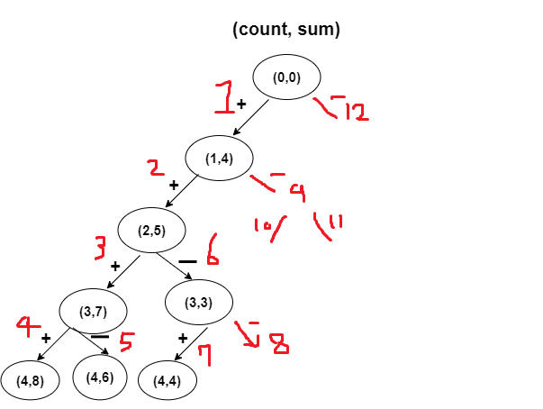

# 5주차 정리- BFS/DFS

### 그래프 탐색 알고리즘

DFS, BFS은 모두 그래프 탐색 알고리즘의 종류 중 한가지이다.

그래프 탐색의 주요 목적은 그래프의 모든 노드 또는 일부 노드를 특정 조건에 따라 방문하고, 이를 통해 정보나 경로를 찾는 것이다.

그래프 = 여러 개체들이 연결되어 있는 자료 구조 


하나를 몰아본다 - DFS

여러 개를 동시에 본다 - BFS

얘네 둘 다 이미 방문한건 안 방문함.


### 문제 유형
- 경로탐색 유형 (최단거리, 시간)
- 네트워크 유형 (연결)
- 조합 유형

### DFS 구현

DFS는 한놈만 끝까지 팸.

1. 스택 자료구조를 사용함. or 재귀함수를 사용함
- 재귀 함수는 구현의 편리성이 존재 ㅇㅇ, 재귀함수는 스택이랑 똑같음 동작방식이
2. 완전 탐색을 수행하기 위해 사용할 수 있는 가장 간단한 방법 


### DFS 기본 동작 방식

1. 시작 노드를 스택에 넣고 방문 처리함
2. 스택에 마지막으로 들어온 노드에 방문하지 않은 인접 노드가 있는지 확인
- 있다면, 방문하지 않은 인접 노드를 스택에 삽입, 방문 처리함
- 없다면, 현재 노드 (스택에 마지막으로 들어온 노드)를 스택에서 추출함
3. 2번 과정을 무한 반복한다. 더 이상 진행X 떄까지


### DFS 사용 예시
- 더 짧은 코드로 간결히 구현해야 하는 경우
- 큐 라이브러리를 사용할 수 없는 경우
- 트리의 순회, 점화식 구현 등 DFS (재귀 구조)에 특화된 문제인 경우 
- 트리에서 최단 거리 탐색을 구하는 경우
 -> 트리에서는 두 노드를 잇는 경로가 하나만 존재한다.


### DFS 구현 in js
```js
// 2차원 배열로 graph를 표현함
// 각 정점이 어떤 정점들과 연결되어있는지
const graph = {
  A: ['B', 'C'],
  B: ['A', 'D'],
  C: ['A', 'G', 'H', 'I'],
  D: ['B', 'E', 'F'],
  E: ['D'],
  F: ['D'],
  G: ['C'],
  H: ['C'],
  I: ['C', 'J'],
  J: ['I']
};


function dfs (graph, v, visited){
    // 현재 노드를 방문처리
    visited[v] = true;
    // 현재 노드와 인접한 노드들 방문처리
    for (i of graph[v]){
        if (!visited[i]){
            dfs(graph, i , visited);
        }
    }
}
```

### DFS를 활용한 완전탐색 
- 흔히 DFS는 모든 노드를 완전 탐색하기 위한 방법으로 사용됨
- 완전 탐색 알고리즘에선 기본적으로 각 노드 및 간선에 대해서 한번씩 확인하도록 함


### BFS

순서가 보장되어야 되기 떄문에 큐나 링크드리스트로 구현

### 그래서 DFS vs BFS 어쩌라고!!!!

둘 다 탐색 알고리즘이기 때문에 어떤 걸 하든 정답은 나옴

DFS를 기본으로 가면서 문제가 복잡해지면 BFS로 풀자

BFS는 어디서부터 틀려먹은건지 분석하기 어려움

DFS가 최적이라 생각하고 재귀함수를 쓰는 것을 익혀두자.


## DFS
그래프의 시작 노드에서부터 깊은 부분을 우선적으로 탐색하는 알고리즘이다. 하나의 경로를 들어갈 수 있을 만큼 깊이 탐색한 후, 다시 위로 올라가 다음 브랜치로 넘어간다.

>>

탐색 방법: 재귀, stack

>>

DFS의 특징

- 자기 자신을 호출하는 순환 알고리즘의 형태를 갖거나, 명시적인 스택을 사용한다.
- 스택을 사용하는 경우, 방문한 정점들을 스택에 저장했다가 꺼내는 과정을 이용한다.
- 어떤 노드를 방문했었는지 여부를 반드시 검사해야 한다.


# 문제 적용 

## 타겟넘버
n개의 음이 아닌 정수들이 있습니다. 이 정수들을 순서를 바꾸지 않고 적절히 더하거나 빼서 타겟 넘버를 만들려고 합니다. 

사용할 수 있는 숫자가 담긴 배열 numbers, 타겟 넘버 target이 매개변수로 주어질 때 숫자를 적절히 더하고 빼서 타겟 넘버를 만드는 방법의 수를 return 하도록 solution 함수를 작성해주세요.


### 접근방식

결과적으로 경우의 수를 구하면 되는 문제이다.

무지성으로 모든 경우의수에 대해서 타겟 넘버랑 일치하지 않는지 확인해보면 안되나?
근데 그러면 배열의 길이가 최대 20이이니까, 2의 20승.. 100만의 경우의 수를 모두 체크해보게 된다. 

과연 모두 체크해야할까? 예를 들어 타겟 넘버가 100이고, 50+50.. 이면은 뒤에 +인 경우는 아예 생각을 안해도 되지 않나? 

--> 왠지 BFS를 써야할거같다?

```js
function solution(numbers, target) {
    let queue = [{ sum: 0, index: 0 }];
    let count = 0;
    
    while (queue.length > 0) {
        let { sum, index } = queue.shift();
        
        // 모든 숫자를 다 사용한 경우
        if (index === numbers.length) {
            if (sum === target) {
                count++;
            }
        } else {
            // 다음 숫자를 더하는 경우
            queue.push({ sum: sum + numbers[index], index: index + 1 });
            // 다음 숫자를 빼는 경우
            queue.push({ sum: sum - numbers[index], index: index + 1 });
        }
    }
    
    return count;
}

```

.. 시간초과 오류?

다시 DFS로 풀이 

```javascript
function solution(numbers, target) {
  let answer = 0;
  const length = numbers.length;

  function dfs(count, sum) {
    if (count === length) {
      if (target === sum) {
        answer++;
      }
      return;
    }

    dfs(count + 1, sum + numbers[count]);
    dfs(count + 1, sum - numbers[count]);
  }

  dfs(0, 0);

  return answer;
}

```

다른 풀이 

```js
function solution(numbers, target) {
    let answer = 0;
    getAnswer(0,0);
    function getAnswer(x,value) {
        if(x<numbers.length){
            getAnswer(x+1,value + numbers[x]);
            getAnswer(x+1,value - numbers[x]);
        } else{
            if(value === target){
                answer++
            }
        }
    }
    return answer;
}
```

