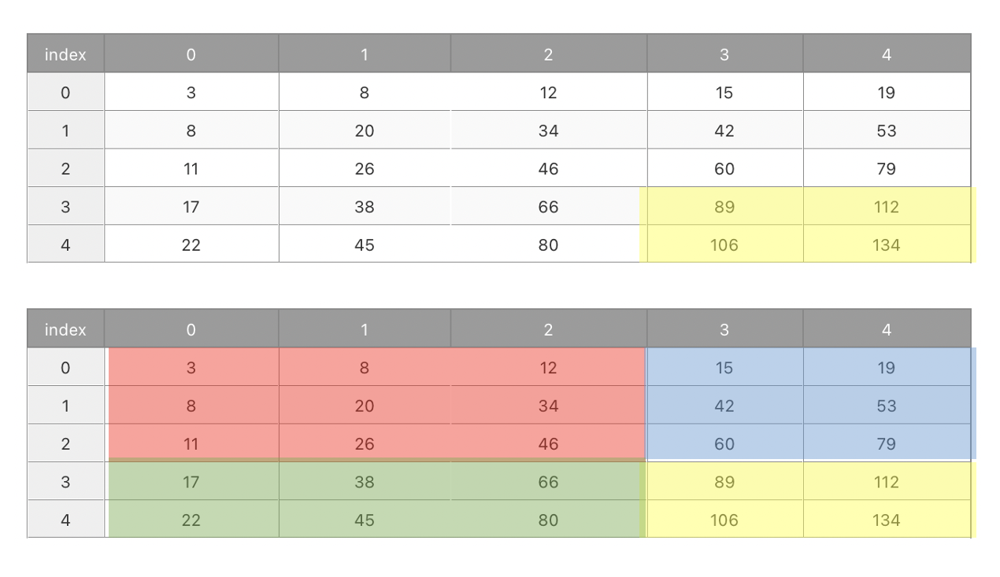

# 누적합? Prefix Sum

`누적합`이란 수열에서 구간의 합을 누적한 값을 말하는 것이다.

예를 들어,

```javascript
const arr = [1, 2, 3, 4, 5];
```

인 배열이 있다면,
<br>arr의 누적합 배열은<br>

```javascript
const psum = [1, 3, 6, 10, 15];
```

로 나타낼 수 있다.

# 누적합 알고리즘?

```javascript
psum[i] = psum[i - 1] + arr[i];
```

# 누적합 알고리즘을 사용했을 때 이점?

- `시간 복잡도`를 줄일 수 있다.
  ```
      누적합 알고리즘을 사용하면, for 이중루프로 실행 시 시간 복잡도 O(n*2)를 <br>
      O(n)으로 줄일 수 있다.
  ```
- `구간합`을 구하는 것이 쉬워진다.

  ```
    arr의 left 인덱스 ~ right 인덱스 구간의 합을 구하고자 할 때,
    arr[right] - arr[left-1] 로 구간의 합을 구할 수 있다.
  ```

# 2차원 배열의 구간합



노랑의 구간합은

```
전체 - (빨+파) - (빨+초) + 빨
```

으로 구한다.

# 백준 11659 구간 합 구하기4

```javascript
const [N, M] = input[0].split(" ").map(Number); // N: 수의 개수, M: 합을 구해야 하는 횟수
const numbers = input[1].split(" ").map(Number); // N개의 수

// 누적 합 배열 생성
const prefixSum = Array(N + 1).fill(0);
for (let i = 1; i <= N; i++) {
  prefixSum[i] = prefixSum[i - 1] + numbers[i - 1];
}

// 결과를 저장할 배열
let result = [];

// 각 쿼리에 대해 구간 합 계산
for (let k = 0; k < M; k++) {
  const [i, j] = input[k + 2].split(" ").map(Number);
  const sum = prefixSum[j] - prefixSum[i - 1];
  result.push(sum);
}

// 결과 출력
console.log(result.join("\n"));
```
